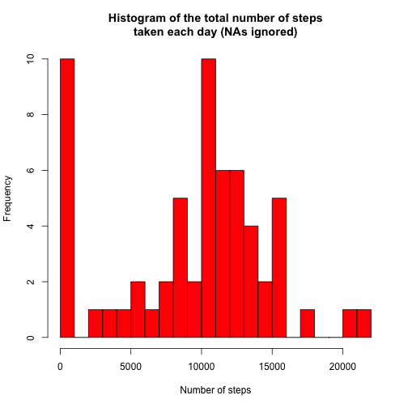
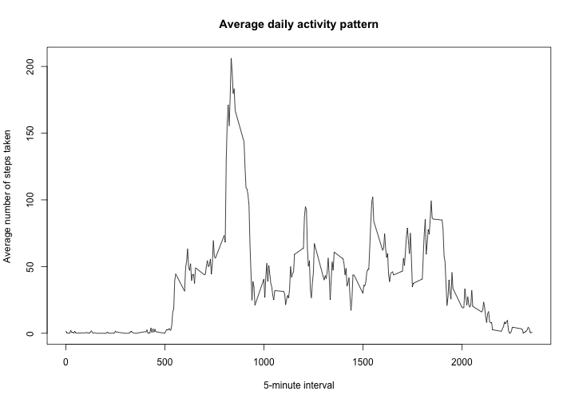
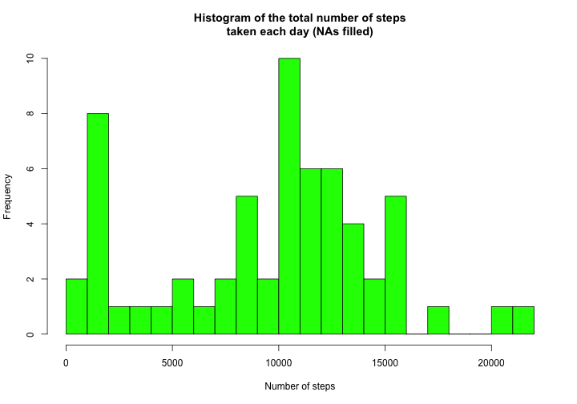
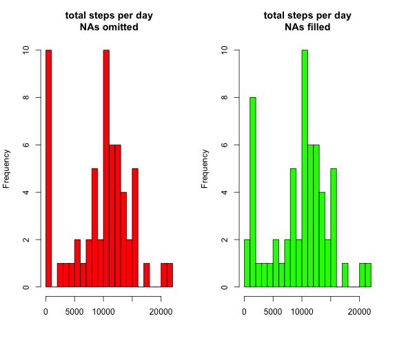
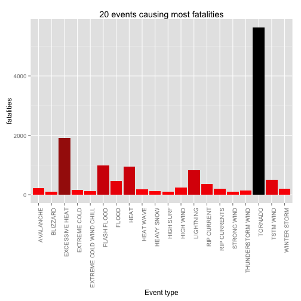
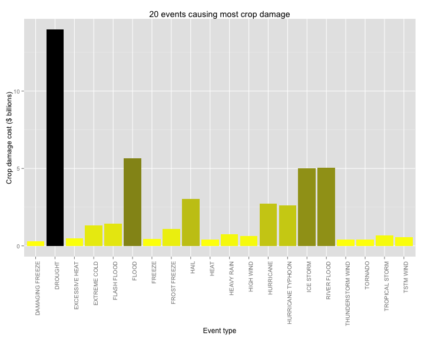

## Introduction

It is now possible to collect a large amount of data about personal movement using activity monitoring devices such as a [Fitbit](http://www.fitbit.com), [Nike Fuelband](http://www.nike.com/us/en_us/c/nikeplus-fuelband), or [Jawbone Up](https://jawbone.com/up). These type of devices are part of the "quantified self" movement -- a group of enthusiasts who take measurements about themselves regularly to improve their health, to find patterns in their behavior, or because they are tech geeks. But these data remain under-utilized both because the raw data are hard to obtain and there is a lack of statistical methods and software for processing and interpreting the data.


This assignment makes use of data from a personal activity monitoring device. This device collects data at 5 minute intervals throughout the day. The data consists of two months of data from an anonymous individual collected during the months of October and November (2012), and includes the number of steps taken in 5-minute intervals each day.


## Data

The data for this assignment can be downloaded from the course web
site: [Activity monitoring data](https://d396qusza40orc.cloudfront.net/repdata%2Fdata%2Factivity.zip) [52K].

The variables included in this dataset are:

* **steps**: Number of steps taking in a 5-minute interval (missing
    values are coded as `NA`)

* **date**: The date on which the measurement was taken in YYYY-MM-DD
    format

* **interval**: Identifier for the 5-minute interval in which
    measurement was taken

The dataset is stored in a comma-separated-value (CSV) file and there
are a total of 17,568 observations in this dataset.


## Loading and preprocessing the data

* Load the data (i.e. `read.csv()`)


```r
# Download and unzip the package
if (!file.exists("activity.csv")) {
  if (!file.exists("activity.zip")) {
    url <- "https://d396qusza40orc.cloudfront.net/repdata%2Fdata%2Factivity.zip"
    download.file(url, "activity.zip", method = "curl")
  }
  unzip("activity.zip")
}

# Load the raw data
activity <- read.csv("activity.csv", stringsAsFactors = F)

# Show the structure and the first part of the loaded data
str(activity)
```

```
## 'data.frame':	17568 obs. of  3 variables:
##  $ steps   : int  NA NA NA NA NA NA NA NA NA NA ...
##  $ date    : chr  "2012-10-01" "2012-10-01" "2012-10-01" "2012-10-01" ...
##  $ interval: int  0 5 10 15 20 25 30 35 40 45 ...
```

```r
head(activity)
```

```
##   steps       date interval
## 1    NA 2012-10-01        0
## 2    NA 2012-10-01        5
## 3    NA 2012-10-01       10
## 4    NA 2012-10-01       15
## 5    NA 2012-10-01       20
## 6    NA 2012-10-01       25
```

* Process/transform the data into a format suitable for further analysis


```r
# Convert the 'date' variable to an date-time object
activity$date <- as.POSIXct(activity$date, format = "%Y-%m-%d")

# Create a character vector 'weekday' from known dates
# (A separate vector is created so there are no useless variables)
weekday <- tolower(weekdays(activity$date))

# Create a variable that indicates day type (weekday/weekend)
activity$daytype <- as.factor(ifelse(weekday == "saturday" | weekday == "sunday", 
                                     "weekend", "weekday"))

# Show the structure and the first part of the processed data
str(activity)
```

```
## 'data.frame':	17568 obs. of  4 variables:
##  $ steps   : int  NA NA NA NA NA NA NA NA NA NA ...
##  $ date    : POSIXct, format: "2012-10-01" "2012-10-01" ...
##  $ interval: int  0 5 10 15 20 25 30 35 40 45 ...
##  $ daytype : Factor w/ 2 levels "weekday","weekend": 1 1 1 1 1 1 1 1 1 1 ...
```

```r
head(activity)
```

```
##   steps       date interval daytype
## 1    NA 2012-10-01        0 weekday
## 2    NA 2012-10-01        5 weekday
## 3    NA 2012-10-01       10 weekday
## 4    NA 2012-10-01       15 weekday
## 5    NA 2012-10-01       20 weekday
## 6    NA 2012-10-01       25 weekday
```

```r
# Clear the workplace
rm(weekday)
```


## What is mean total number of steps taken per day?

For this part of the assignment, we ignore the missing values in the dataset.

* Make a histogram of the total number of steps taken each day


```r
# Create a dataframe with summarized data
daily.steps <- aggregate(activity$steps, list(activity$date), 
                         FUN = sum, na.rm = TRUE)
colnames(daily.steps) <- c("day", "total.steps")

# Make the histogram
hist(daily.steps$total.steps, breaks = 20, xlab = "Number of steps", main = "Histogram of the total number of steps\ntaken each day (NAs ignored)", col="red")
```

 

* Calculate and report the mean and median total number of steps taken per day


```r
mean(daily.steps$total.steps)
```

```
## [1] 9354.23
```

```r
median(daily.steps$total.steps)
```

```
## [1] 10395
```

* The mean total number of steps taken per day: **9354.2295082**
* The median total number of steps taken per day: **10395**

## What is the average daily activity pattern?

* Make a time series plot (i.e. `type = "l"`) of the 5-minute interval (x-axis) and the average number of steps taken, averaged across all days (y-axis)


```r
interval.steps <- aggregate(activity$steps, 
                            by = list(activity$interval), 
                            FUN = mean, na.rm = TRUE)
colnames(interval.steps) <- c("interval", "average.steps")
plot(interval.steps$interval, interval.steps$average.steps, 
     type = "l", main = "Average daily activity pattern", 
     xlab = "5-minute interval", 
     ylab = "Average number of steps taken")
```

 

* Which 5-minute interval, on average across all the days in the dataset, contains the maximum number of steps?


```r
interval.steps[which.max(interval.steps$average.steps),]
```

```
##     interval average.steps
## 104      835      206.1698
```

The maximum number of steps is contained in the **835** 5-minute interval. It contains **206.1698113** steps.

## Imputing missing values

There are a number of days/intervals where there are missing values (coded as `NA`). The presence of missing days may introduce bias into some calculations or summaries of the data.

* Calculate and report the total number of missing values in the dataset (i.e. the total number of rows with NAs). Due to the fact that only the `steps` variable has missing values, the total number of rows with missing values in the dataset equals to the total number of missing values in the `steps` column:


```r
sum(is.na(activity$steps))
```

```
## [1] 2304
```

There are **2304** missing values in the dataset.

* Devise a strategy for filling in all of the missing values in the dataset. A strategy for filling in all of the missing values in the dataset us to use the median values for the 5-minute intervals. 


```r
filling.steps <- aggregate(activity$steps, 
                            by = list(activity$interval), 
                            FUN = median, na.rm = TRUE)
colnames(filling.steps) <- c("interval", "median.steps")
```

* Create a new dataset that is equal to the original dataset but with the missing data filled in. 


```r
# We merge the original dataset with this dataframe and fill the missing values
filled.activity <- merge(activity, filling.steps)
filled.activity$new.steps <- ifelse(is.na(filled.activity$steps), 
                                filled.activity$median.steps, filled.activity$steps)
```

* Make a histogram of the total number of steps taken each day. Calculate and report the mean and median total number of steps taken per day. 


```r
daily.filled.steps <- aggregate(filled.activity$new.steps, 
                                list(filled.activity$date), 
                                FUN = sum, na.rm = TRUE)
colnames(daily.filled.steps) <- c("day", "total.steps")

hist(daily.filled.steps$total.steps, breaks = 20, xlab = "Number of steps", 
     main = "Histogram of the total number of steps\ntaken each day (NAs filled)", 
     col="green")
```

 

```r
mean(daily.filled.steps$total.steps)
```

```
## [1] 9503.869
```

```r
median(daily.filled.steps$total.steps)
```

```
## [1] 10395
```


**Do these values differ from the estimates from the first part of the assignment? What is the impact of imputing missing data on the estimates of the total daily number of steps?**

As we can see in the figure below, the new dataset *slightly* differs from the original dataset:




```
##         na.omitted na.filled
## Min.             0        41
## 1st Qu.       6778      6778
## Median       10400     10400
## Mean          9354      9504
## 3rd Qu.      12810     12810
## Max.         21190     21190
```

If we look at summaries of these two datasets, we may notice that only `Min.` and `Mean` values have changed:

* The minima value changed from **0** to **41**. In the original dataset, there are days with no recordings at all (`NA`s only), and *total steps* for these days are `0`. Then we fill `NA`s, and since there are no days without any activity at all, there are no more zero *total steps*.

* As the consequence, the mean value changed. 

This is why I think choosing mean instead of medium is tricky. If we fill the dataset with means for the corresponding intervals, everything would change drastically:

 

```r
# Mean and median
```

```
## [1] 10766.19
```

```
## [1] 10766.19
```

## Are there differences in activity patterns between weekdays and weekends?

1. We have already created a factor variable `daytype` in the dataset with two levels, `weekday` and `weekend` indicating whether a given date is a weekday or weekend day.

2. Make a panel plot containing a time series plot (i.e. `type = "l"`) of the 5-minute interval (x-axis) and the average number of steps taken, averaged across all weekday days or weekend days (y-axis).

There are some differences in activity patterns between weekdays and weekends, as well as there are similar patterns.

* Almost no activity in (0-500) interval in both cases (sleep).
* Nevertheless, there is some activity on weekends in this interval (night life, maybe).
* Much more steps in (500-1000) interval on weekdays, comparing to low activity at this time on weekends (going to work vs. sleeping).
* Quite random yet high activity on weekends (no schedule).
* Low activity on weekdays (office work, maybe), with short intervals of high activity (lunch, for example).

I think, the daily activity patterns are pretty understandable, though these plots give us an opportunity to literally see these patterns and the differences between them.


```r
week.steps <- aggregate(filled.activity$new.steps, 
                        by = list(filled.activity$daytype, 
                                  filled.activity$interval),
                        mean)
colnames(week.steps) <- c("daytype", "interval", "average.steps")

library(lattice)
xyplot(average.steps ~ interval | daytype, data = week.steps, 
       type = "l", layout = c(1, 2), 
       xlab = "Interval", ylab = "Number of steps", 
       main = "Average daily activity pattern for weekends and weekdays")
```

 

