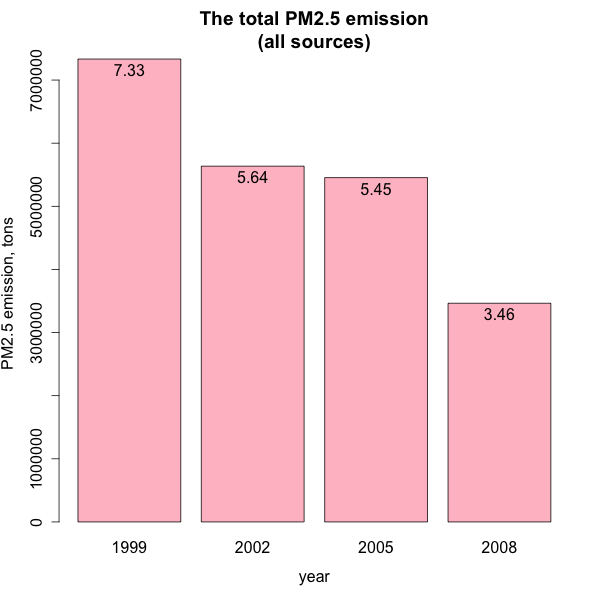
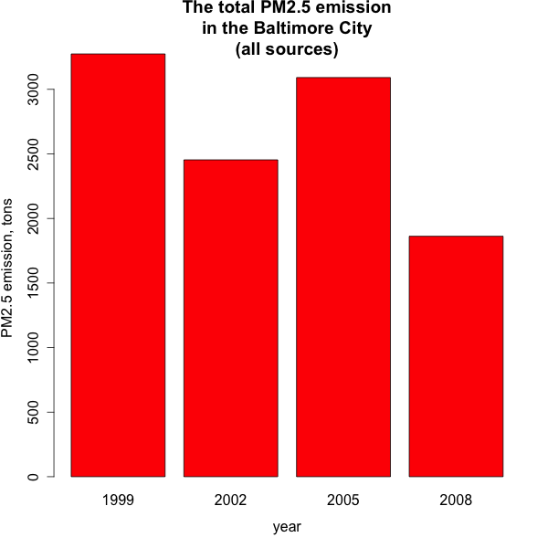
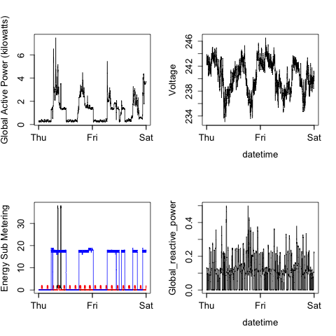

# Exploratory Data Analysis: Course Project 2

Table of contents:
* [Introduction](#introduction)
* [Data](#data)
* [Assignment](#assignment)
* [Result](#result)
  * [Question 1](#question-1)
  * [Question 2](#question-2)
  * [Question 3](#question-3)
  * [Question 4](#question-4)
  * [Question 5](#question-5)
  * [Question 6](#question-6)

## Introduction

Fine particulate matter (PM2.5) is an ambient air pollutant for which there is strong evidence that it is harmful to human health. In the United States, the Environmental Protection Agency (EPA) is tasked with setting national ambient air quality standards for fine PM and for tracking the emissions of this pollutant into the atmosphere. Approximately every 3 years, the EPA releases its database on emissions of PM2.5. This database is known as the National Emissions Inventory (NEI). You can read more information about the NEI at the EPA National Emissions Inventory web site.


[image source](http://www.sltrib.com/sltrib/politics/57159228-90/utah-quality-pollution-lake.html.csp)

For each year and for each type of PM source, the NEI records how many tons of PM2.5 were emitted from that source over the course of the entire year. The data that you will use for this assignment are for 1999, 2002, 2005, and 2008.

## Data

The data for this assignment are available from the course web site as a single zip file:

[:package: Data for Peer Assessment](https://d396qusza40orc.cloudfront.net/exdata%2Fdata%2FNEI_data.zip) [29Mb]

The zip file contains two files:

**PM2.5 Emissions Data** (`summarySCC_PM25.rds`). This file contains a data frame with all of the PM2.5 emissions data for 1999, 2002, 2005, and 2008. For each year, the table contains number of tons of PM2.5 emitted from a specific type of source for the entire year. Here are the first few rows.

```
##     fips      SCC Pollutant Emissions  type year
## 4  09001 10100401  PM25-PRI    15.714 POINT 1999
## 8  09001 10100404  PM25-PRI   234.178 POINT 1999
## 12 09001 10100501  PM25-PRI     0.128 POINT 1999
## 16 09001 10200401  PM25-PRI     2.036 POINT 1999
## 20 09001 10200504  PM25-PRI     0.388 POINT 1999
## 24 09001 10200602  PM25-PRI     1.490 POINT 1999
```

* `fips`: A five-digit number (represented as a string) indicating the U.S. county

* `SCC`: The name of the source as indicated by a digit string (see source code classification table)

* `Pollutant`: A string indicating the pollutant

* `Emissions`: Amount of PM2.5 emitted, in tons

* `type`: The type of source (point, non-point, on-road, or non-road)

* `year`: The year of emissions recorded

**Source Classification Code Table** (`Source_Classification_Code.rds`). This table provides a mapping from the SCC digit strings in the Emissions table to the actual name of the PM2.5 source. The sources are categorized in a few different ways from more general to more specific and you may choose to explore whatever categories you think are most useful. For example, source “10100101” is known as “Ext Comb /Electric Gen /Anthracite Coal /Pulverized Coal”.

You can read each of the two files using the `readRDS()` function in R. For example, reading in each file can be done with the following code:

```
## This first line will likely take a few seconds. Be patient!
NEI <- readRDS("summarySCC_PM25.rds")
SCC <- readRDS("Source_Classification_Code.rds")
```

as long as each of those files is in your current working directory (check by calling `dir()` and see if those files are in the listing).

## Assignment

The overall **goal of this assignment** is to explore the National Emissions Inventory database and see what it say about fine particulate matter pollution in the United states over the 10-year period 1999–2008. You may use any R package you want to support your analysis.

### Questions

You must address the following questions and tasks in your exploratory analysis. For each question/task you will need to make a single plot. Unless specified, you can use any plotting system in R to make your plot.

1. Have total emissions from PM2.5 decreased in the United States from 1999 to 2008? Using the base plotting system, make a plot showing the total PM2.5 emission from all sources for each of the years 1999, 2002, 2005, and 2008.

2. Have total emissions from PM2.5 decreased in the Baltimore City, Maryland (`fips == "24510"`) from 1999 to 2008? Use the base plotting system to make a plot answering this question.

3. Of the four types of sources indicated by the `type` (point, nonpoint, onroad, nonroad) variable, which of these four sources have seen decreases in emissions from 1999–2008 for Baltimore City? Which have seen increases in emissions from 1999–2008? Use the ggplot2 plotting system to make a plot answer this question.

4. Across the United States, how have emissions from coal combustion-related sources changed from 1999–2008?

5. How have emissions from motor vehicle sources changed from 1999–2008 in Baltimore City?

6. Compare emissions from motor vehicle sources in Baltimore City with emissions from motor vehicle sources in Los Angeles County, California (`fips == "06037"`). Which city has seen greater changes over time in motor vehicle emissions?

### Making and Submitting Plots

For each plot you should

1. Construct the plot and save it to a PNG file.

2. Create a separate R code file (`plot1.R`, `plot2.R`, etc.) that constructs the corresponding plot, i.e. code in `plot1.R` constructs the `plot1.png` plot. Your code file should include code for reading the data so that the plot can be fully reproduced. You must also include the code that creates the PNG file. Only include the code for a single plot (i.e. `plot1.R` should only include code for producing `plot1.png`)

3. Upload the PNG file on the Assignment submission page

4. Copy and paste the R code from the corresponding R file into the text box at the appropriate point in the peer assessment.

## Result

This code reads the data (it is included into every R file):

```
# Load and extract the data into the working directory
if (!file.exists("NEI_data/")) {
  url <- "https://d396qusza40orc.cloudfront.net/exdata%2Fdata%2FNEI_data.zip"
  download.file(url, destfile = "NEI_data.zip", method = "curl")
  unzip("NEI_data.zip", exdir = "NEI_data/")
}

# Load the data into the environment
if (!exists("nei")) { nei <- readRDS("NEI_data/summarySCC_PM25.rds") }
if (!exists("scc")) { scc <- readRDS("NEI_data/Source_Classification_Code.rds") }

```

### Question 1 

Have total emissions from PM2.5 decreased in the United States from 1999 to 2008? Using the base plotting system, make a plot showing the total PM2.5 emission from all sources for each of the years 1999, 2002, 2005, and 2008.

```
# Aggregate the amout of PM2.5 emission by year
emission.by.year <- aggregate(Emissions ~ year, data = nei, FUN = sum)

# Create the plot
options(scipen = 20)
with(emission.by.year, 
     barplot(height = Emissions, xlab = "year", names.arg = year, 
             ylab = "PM2.5 emission, tons", col="orange",
             main="The total PM2.5 emission\n(all sources)", yaxs="i"))

# Save the plot
dev.copy(png, "plot1.png", width=600, height=600)
dev.off()
```



### Question 2

Have total emissions from PM2.5 decreased in the Baltimore City, Maryland (`fips == "24510"`) from 1999 to 2008? Use the base plotting system to make a plot answering this question.

```
# Aggregate the amout of PM2.5 emission by year for the Baltimore City
emission.by.year <- aggregate(Emissions ~ year, data = subset(nei, fips=="24510"), FUN = sum)

# Create the plot
options(scipen = 20)
with(emission.by.year, 
     barplot(height = Emissions, xlab = "year", names.arg = year, 
             ylab = "PM2.5 emission, tons", col="red",
             main="The total PM2.5 emission\nin the Baltimore City\n(all sources)", yaxs="i"))

# Save the plot
dev.copy(png, "plot2.png", width=600, height=600)
dev.off()
```



### Question 3

Of the four types of sources indicated by the `type` (point, nonpoint, onroad, nonroad) variable, which of these four sources have seen decreases in emissions from 1999–2008 for Baltimore City? Which have seen increases in emissions from 1999–2008? Use the ggplot2 plotting system to make a plot answer this question.

```
# Aggregate the amout of PM2.5 emission by year and source for Baltimore City
emission.for.baltimore <- aggregate(Emissions ~ year + type, 
                              data = subset(nei, fips=="24510"), FUN = sum)

# Create the plot
library(ggplot2)
ggplot(data = emission.for.baltimore, aes(factor(year), Emissions)) + 
  facet_grid(. ~ type) + geom_bar(stat = "identity") +
  xlab("year") + ylab("Emission, tons") +
  ggtitle("Emissions from different types of sources\nin Baltimore City")

# Save the plot
dev.copy(png, "plot3.png", width=600, height=600)
dev.off()
```


### Question 4

Across the United States, how have emissions from coal combustion-related sources changed from 1999–2008?

```
# Merge the NEI and SCC data and select rows with "coal" in SCC Short Name
nei.with.scc <- merge(nei, scc, by = "SCC")
source.is.coal.related <- grepl("coal", nei.with.scc$Short.Name, ignore.case=TRUE)
chosen.data <- nei.with.scc[source.is.coal.related, ]

# Aggregate the amout of PM2.5 emission from coal combustion-related sources by year
emission.from.coal <- aggregate(Emissions ~ year, 
                                    data = chosen.data, FUN = sum)

# Create the plot
library(ggplot2)
ggplot(data = emission.from.coal, aes(factor(year), Emissions)) + 
  geom_bar(stat = "identity") +
  xlab("year") + ylab("Emission, tons") +
  ggtitle("Emissions from coal combustion-related sources")

# Save the plot
dev.copy(png, "plot4.png", width=600, height=600)
dev.off()

```



### Question 5

How have emissions from motor vehicle sources changed from 1999–2008 in Baltimore City?

```
# Aggregate the amout of PM2.5 emission by year 
# for the Baltimore City AND motor vehicle sources
emission.from.motor.in.baltimore <- aggregate(Emissions ~ year, data = 
                                subset(nei, fips=="24510" & type=="ON-ROAD"), FUN = sum)

# Create the plot
library(ggplot2)
ggplot(emission.from.motor.in.baltimore, aes(factor(year), Emissions)) + 
  geom_bar(stat="identity") + 
  xlab(label = "year") + ylab(label = "Emissions, tons") + 
  ggtitle(label = "Emissions from motor vehicle sources in Baltimore")

# Save the plot
dev.copy(png, "plot5.png", width=600, height=600)
dev.off()

```


### Question 6

Compare emissions from motor vehicle sources in Baltimore City with emissions from motor vehicle sources in Los Angeles County, California (`fips == "06037"`). Which city has seen greater changes over time in motor vehicle emissions?

```
# Aggregate the amout of PM2.5 emission by year 
# for Baltimore City OR Los Angeles County
# AND On-Road type of sources
chosen.nei <- subset(nei, type=="ON-ROAD")
chosen.nei <- subset(chosen.nei, (fips=="06037" | fips=="24510"))
emission.from.motor <- aggregate(Emissions ~ year + fips, data = chosen.nei, FUN = sum)
emission.from.motor$fips[emission.from.motor$fips=="06037"] <- "Los Angeles"
emission.from.motor$fips[emission.from.motor$fips=="24510"] <- "Baltimore City"

# Create the plot
library(ggplot2)
ggplot(emission.from.motor, aes(factor(year), Emissions)) + 
  facet_grid(. ~ fips) + geom_bar(stat="identity") + 
  xlab(label = "year") + ylab(label = "Emissions, tons") + 
  ggtitle(label = "Emissions from motor vehicle sources\nin Los Angeles and Baltimore")

# Save the plot
dev.copy(png, "plot6.png", width=600, height=600)
dev.off()
```


