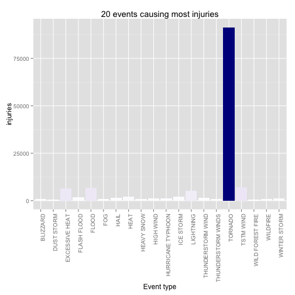
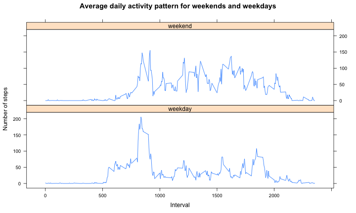

Your document should have a title that briefly summarizes your data analysis

## Synopsis

Synopsis: Immediately after the title, there should be a synopsis which describes and summarizes your analysis in at most 10 complete sentences.

The analysis document must have at least one figure containing a plot. Your analyis must have no more than three figures. Figures may have multiple plots in them (i.e. panel plots), but there cannot be more than three figures total.

You must show all your code for the work in your analysis document. This may make the document a bit verbose, but that is okay. In general, you should ensure that echo = TRUE for every code chunk (this is the default setting in knitr).

### Questions

1. Across the United States, which types of events (as indicated in the `EVTYPE` variable) are most harmful with respect to population health?

2. Across the United States, which types of events have the greatest economic consequences?

## Data

The data for this assignment (comma-separated-value file compressed via the bzip2 algorithm):

* [Storm Data][1] [47Mb]

Documentation of the database:

* National Weather Service [Storm Data Documentation][2]
* National Climatic Data Center Storm Events [FAQ][3]

[1]: https://d396qusza40orc.cloudfront.net/repdata%2Fdata%2FStormData.csv.bz2
[2]: https://d396qusza40orc.cloudfront.net/repdata%2Fpeer2_doc%2Fpd01016005curr.pdf
[3]: https://d396qusza40orc.cloudfront.net/repdata%2Fpeer2_doc%2FNCDC%20Storm%20Events-FAQ%20Page.pdf

The events in the database start in the year 1950 and end in November 2011. In the earlier years of the database there are generally fewer events recorded, most likely due to a lack of good records. More recent years should be considered more complete.

## Setting up


```r
echo = TRUE # to ensure that all code will be shown

options(scipen = 1)

library(dplyr)
library(tidyr)
library(ggplot2)
library(data.table)
library(R.utils)
```

## Import the data

The CSV file is very large (561.6 MB), so to load the data for the first time we use `fread()` method. In R Documentation `fread {data.table}` is described as similar to `read.table` but faster and more convenient.

After reading in the original CSV file, we save the dataset as an RDS file so we could restore the dataset via `readRDS()`. `readRDS()` is considered faster than other `read` methods.

The following chunk of code checks if there is an RDS file (if there isn't, it creates it (from the CSV file which is created by unpacking the BZ2 package)) and loads the data into workspace.


```r
# Download and import the data

if (!file.exists("StormData.rds")) {
  # If we don't have the csv, we need to unpack the .bz2 file
  if (!file.exists("StormData.csv")) {
    # If we don't have the .bz2 file, we need to download it
    if (!file.exists("StormData.csv.bz2")) {
      download.file("https://d396qusza40orc.cloudfront.net/repdata%2Fdata%2FStormData.csv.bz2",
                    "StormData.csv.bz2")
    }
    bunzip2("StormData.csv.bz2")
  }
  raw.storm <- fread("StormData.csv", na.strings = c("NA", ""))
  saveRDS(storm, "StormData.rds")
  file.remove("StormData.csv")
}

# Load the data into workspace unless we it already exists
if (!exists("raw.storm")) {
  raw.storm <- readRDS("StormData.rds")
}

#============================================================== Create a subset ???????
```

## Data Processing

Quick overview of the internal structure of the dataset and its first three rows:


```r
str(raw.storm)
```

```
## Classes 'data.table' and 'data.frame':	902297 obs. of  37 variables:
##  $ STATE__   : num  1 1 1 1 1 1 1 1 1 1 ...
##  $ BGN_DATE  : chr  "4/18/1950 0:00:00" "4/18/1950 0:00:00" "2/20/1951 0:00:00" "6/8/1951 0:00:00" ...
##  $ BGN_TIME  : chr  "0130" "0145" "1600" "0900" ...
##  $ TIME_ZONE : chr  "CST" "CST" "CST" "CST" ...
##  $ COUNTY    : num  97 3 57 89 43 77 9 123 125 57 ...
##  $ COUNTYNAME: chr  "MOBILE" "BALDWIN" "FAYETTE" "MADISON" ...
##  $ STATE     : chr  "AL" "AL" "AL" "AL" ...
##  $ EVTYPE    : chr  "TORNADO" "TORNADO" "TORNADO" "TORNADO" ...
##  $ BGN_RANGE : num  0 0 0 0 0 0 0 0 0 0 ...
##  $ BGN_AZI   : chr  NA NA NA NA ...
##  $ BGN_LOCATI: chr  NA NA NA NA ...
##  $ END_DATE  : chr  NA NA NA NA ...
##  $ END_TIME  : chr  NA NA NA NA ...
##  $ COUNTY_END: num  0 0 0 0 0 0 0 0 0 0 ...
##  $ COUNTYENDN: logi  NA NA NA NA NA NA ...
##  $ END_RANGE : num  0 0 0 0 0 0 0 0 0 0 ...
##  $ END_AZI   : chr  NA NA NA NA ...
##  $ END_LOCATI: chr  NA NA NA NA ...
##  $ LENGTH    : num  14 2 0.1 0 0 1.5 1.5 0 3.3 2.3 ...
##  $ WIDTH     : num  100 150 123 100 150 177 33 33 100 100 ...
##  $ F         : chr  "3" "2" "2" "2" ...
##  $ MAG       : num  0 0 0 0 0 0 0 0 0 0 ...
##  $ FATALITIES: num  0 0 0 0 0 0 0 0 1 0 ...
##  $ INJURIES  : num  15 0 2 2 2 6 1 0 14 0 ...
##  $ PROPDMG   : num  25 2.5 25 2.5 2.5 2.5 2.5 2.5 25 25 ...
##  $ PROPDMGEXP: chr  "K" "K" "K" "K" ...
##  $ CROPDMG   : num  0 0 0 0 0 0 0 0 0 0 ...
##  $ CROPDMGEXP: chr  NA NA NA NA ...
##  $ WFO       : chr  NA NA NA NA ...
##  $ STATEOFFIC: chr  NA NA NA NA ...
##  $ ZONENAMES : chr  NA NA NA NA ...
##  $ LATITUDE  : num  3040 3042 3340 3458 3412 ...
##  $ LONGITUDE : num  8812 8755 8742 8626 8642 ...
##  $ LATITUDE_E: num  3051 0 0 0 0 ...
##  $ LONGITUDE_: num  8806 0 0 0 0 ...
##  $ REMARKS   : chr  NA NA NA NA ...
##  $ REFNUM    : num  1 2 3 4 5 6 7 8 9 10 ...
##  - attr(*, ".internal.selfref")=<externalptr>
```

```r
head(raw.storm, n = 3)
```

```
##    STATE__          BGN_DATE BGN_TIME TIME_ZONE COUNTY COUNTYNAME STATE
## 1:       1 4/18/1950 0:00:00     0130       CST     97     MOBILE    AL
## 2:       1 4/18/1950 0:00:00     0145       CST      3    BALDWIN    AL
## 3:       1 2/20/1951 0:00:00     1600       CST     57    FAYETTE    AL
##     EVTYPE BGN_RANGE BGN_AZI BGN_LOCATI END_DATE END_TIME COUNTY_END
## 1: TORNADO         0      NA         NA       NA       NA          0
## 2: TORNADO         0      NA         NA       NA       NA          0
## 3: TORNADO         0      NA         NA       NA       NA          0
##    COUNTYENDN END_RANGE END_AZI END_LOCATI LENGTH WIDTH F MAG FATALITIES
## 1:         NA         0      NA         NA   14.0   100 3   0          0
## 2:         NA         0      NA         NA    2.0   150 2   0          0
## 3:         NA         0      NA         NA    0.1   123 2   0          0
##    INJURIES PROPDMG PROPDMGEXP CROPDMG CROPDMGEXP WFO STATEOFFIC ZONENAMES
## 1:       15    25.0          K       0         NA  NA         NA        NA
## 2:        0     2.5          K       0         NA  NA         NA        NA
## 3:        2    25.0          K       0         NA  NA         NA        NA
##    LATITUDE LONGITUDE LATITUDE_E LONGITUDE_ REMARKS REFNUM
## 1:     3040      8812       3051       8806      NA      1
## 2:     3042      8755          0          0      NA      2
## 3:     3340      8742          0          0      NA      3
```

There are 37 columns and 902297 rows in this dataset.


```r
dim(raw.storm)
```

```
## [1] 902297     37
```

```r
names(raw.storm)
```

```
##  [1] "STATE__"    "BGN_DATE"   "BGN_TIME"   "TIME_ZONE"  "COUNTY"    
##  [6] "COUNTYNAME" "STATE"      "EVTYPE"     "BGN_RANGE"  "BGN_AZI"   
## [11] "BGN_LOCATI" "END_DATE"   "END_TIME"   "COUNTY_END" "COUNTYENDN"
## [16] "END_RANGE"  "END_AZI"    "END_LOCATI" "LENGTH"     "WIDTH"     
## [21] "F"          "MAG"        "FATALITIES" "INJURIES"   "PROPDMG"   
## [26] "PROPDMGEXP" "CROPDMG"    "CROPDMGEXP" "WFO"        "STATEOFFIC"
## [31] "ZONENAMES"  "LATITUDE"   "LONGITUDE"  "LATITUDE_E" "LONGITUDE_"
## [36] "REMARKS"    "REFNUM"
```

Since these column names are not obvious, I've made an attempt to explain these variables. You can see the results in [this table](https://github.com/demidovakatya/repdata-peer-assessment-2/blob/master/variable_explanation.md).

These variables may be useful for further analysis:

Variable name | Class | Explanation
--------------|-------|------------
BGN_DATE | chr | Date when the event began
STATE | chr | State where the event happened
EVTYPE | chr | Event type
FATALITIES | num | Number of fatalities caused by the event
INJURIES | num | Number of injuries caused by the event
PROPDMG | num | Property damage caused by the event
PROPDMGEXP | chr | Property damage multiplier
CROPDMG | num | Crops damage caused by the event
CROPDMGEXP | chr | Crops damage multiplier

Create a new dataset from these columns:


```r
storm <- raw.storm %>% select(one_of(c("BGN_DATE", "STATE", "EVTYPE", "FATALITIES", "INJURIES", "PROPDMG", "CROPDMG", "PROPDMGEXP", "CROPDMGEXP")))

colnames(storm) <- tolower(colnames(storm))
```

Convert multipliers in `propdmgexp` and `cropdmgexp` columns into numeric values:


```r
# A helper function is needed here
storm$propdmgexp <- toupper(storm$propdmgexp)
storm$propdmgexp[storm$propdmgexp=="B"] <- 9
storm$propdmgexp[storm$propdmgexp=="M"] <- 6
storm$propdmgexp[storm$propdmgexp=="K"] <- 3
storm$propdmgexp[storm$propdmgexp=="H"] <- 2
storm$propdmgexp[storm$propdmgexp=="?" | storm$propdmgexp=="+" | storm$propdmgexp=="-"] <- 0
storm$propdmgexp[is.na(storm$propdmgexp)] <- 0
storm$propdmgexp <- as.numeric(storm$propdmgexp)
storm$cropdmgexp <- toupper(storm$cropdmgexp)
storm$cropdmgexp[storm$cropdmgexp=="B"] <- 9
storm$cropdmgexp[storm$cropdmgexp=="M"] <- 6
storm$cropdmgexp[storm$cropdmgexp=="K"] <- 3
storm$cropdmgexp[storm$cropdmgexp=="H"] <- 2
storm$cropdmgexp[storm$cropdmgexp=="?" | storm$cropdmgexp=="+" | storm$cropdmgexp=="-"] <- 0
storm$cropdmgexp[is.na(storm$cropdmgexp)] <- 0
storm$cropdmgexp <- as.numeric(storm$cropdmgexp)
```

Apply the multipliers:


```r
storm <- storm %>% mutate(propdmg=propdmg * 10 ^ propdmgexp)
storm <- storm %>% mutate(cropdmg=cropdmg * 10 ^ cropdmgexp)

# Remove ~dmgexp columns
storm <- storm %>% select(-ends_with("dmgexp"))
```

Convert `state` into factor variable:


```r
storm$state <- as.factor(storm$state)
```

Convert dates:

```r
storm$bgn_date <- as.Date(storm$bgn_date, format = "%m/%d/%Y %H:%M:%S")
```

The last thing is to tidy up the `evtype` column. Let's save it to a separate variable and then have a look at it:

```r
head(data.frame(table(storm$evtype)), n=20)
```

```
##                      Var1 Freq
## 1      HIGH SURF ADVISORY    1
## 2           COASTAL FLOOD    1
## 3             FLASH FLOOD    1
## 4               LIGHTNING    1
## 5               TSTM WIND    4
## 6         TSTM WIND (G45)    1
## 7              WATERSPOUT    1
## 8                    WIND    1
## 9                       ?    1
## 10        ABNORMAL WARMTH    4
## 11         ABNORMALLY DRY    2
## 12         ABNORMALLY WET    1
## 13   ACCUMULATED SNOWFALL    4
## 14    AGRICULTURAL FREEZE    6
## 15          APACHE COUNTY    1
## 16 ASTRONOMICAL HIGH TIDE  103
## 17  ASTRONOMICAL LOW TIDE  174
## 18               AVALANCE    1
## 19              AVALANCHE  386
## 20           BEACH EROSIN    1
```

We can see similar values, for example:
* "Freezing rain"
* "Freezing Rain"
* "FREEZING RAIN"
* "FREEZING RAIN AND SLEET"

or:
* "HIGH WIND/SEAS"
* "HIGH WIND/WIND CHILL"
* "HIGH WIND/WIND CHILL/BLIZZARD" 
* "HIGH WINDS"
* "HIGH WINDS 55"
* "HIGH WINDS 57"
* "HIGH WINDS 58"
* "HIGH WINDS 63"
* "HIGH WINDS 66"                 
* "HIGH WINDS 67".

From my point of view, these values may be considered equal. So, I'll convert all values in `evtype` column to uppercase strings, trim them, and delete punctuation and digits.


```r
storm$evtype <- toupper(storm$evtype)
storm$evtype <- gsub("[[:digit:]]+", "", storm$evtype)
storm$evtype <- gsub("&", " AND ", storm$evtype)
storm$evtype <- gsub("[[:punct:]]+", " ", storm$evtype)
storm$evtype <- gsub("^\\s+|\\s+$|\\s\\s+", "", storm$evtype)

storm$evtype <- as.factor(storm$evtype)
```

Now we still have things like `AVALANCHE` and `AVALANCE`, but we can consider them insignificant.

## Results

There are two questions to be answered in the assignment:

1. Across the United States, which types of events are most harmful with respect to population health?
2. Across the United States, which types of events have the greatest economic consequences?

To begin with, I'll create a table containing data summarized by event type:


```r
event.types <- storm %>% group_by(evtype) %>% 
  summarise(fatalities = sum(fatalities), injuries = sum(injuries),
            propdmg = sum(propdmg), cropdmg = sum(cropdmg))

head(event.types, n = 10)
```

```
##                       evtype fatalities injuries     propdmg    cropdmg
## 1                    TORNADO       5633    91346 56947380676  414953270
## 2                  TSTM WIND        504     6957  4493127495  554007350
## 3                       HAIL         15     1361 15735819513 3026044473
## 4              FREEZING RAIN          7       23     8146500          0
## 5                       SNOW          5       31    14827550      10000
## 6      ICE STORM FLASH FLOOD          0        2           0          0
## 7                   SNOW ICE          0        0       30000          0
## 8               WINTER STORM        206     1321  6688497251   26944000
## 9  HURRICANE OPAL HIGH WINDS          2        0   100000000   10000000
## 10        THUNDERSTORM WINDS         64      909  1944695859  190654788
```

Events causing most fatalities:

```r
fatality.events <- storm %>% group_by(evtype) %>% summarise(fatalities=sum(fatalities)) %>% top_n(20) %>% arrange(desc(fatalities))
```

```
## Selecting by fatalities
```

```r
fatality.events
```

```
## Source: local data table [20 x 2]
## 
##                     evtype fatalities
##                     (fctr)      (dbl)
## 1                  TORNADO       5633
## 2           EXCESSIVE HEAT       1903
## 3              FLASH FLOOD        978
## 4                     HEAT        937
## 5                LIGHTNING        817
## 6                TSTM WIND        504
## 7                    FLOOD        470
## 8              RIP CURRENT        368
## 9                HIGH WIND        248
## 10               AVALANCHE        224
## 11            WINTER STORM        206
## 12            RIP CURRENTS        204
## 13               HEAT WAVE        172
## 14            EXTREME COLD        162
## 15       THUNDERSTORM WIND        133
## 16              HEAVY SNOW        127
## 17 EXTREME COLD WIND CHILL        125
## 18               HIGH SURF        104
## 19             STRONG WIND        103
## 20                BLIZZARD        101
```

```r
qplot(evtype, fatalities, data=fatality.events, geom="bar", stat="identity", xlab="Event type", main="20 events causing most fatalities", fill=fatalities) + scale_fill_continuous(low="red", high="black") + theme(axis.text.x = element_text(angle = 90, hjust = 1), legend.position="none")
```

 

Events causing most injuries:

```r
injury.events <- storm %>% group_by(evtype) %>% summarise(injuries=sum(injuries)) %>% top_n(20) %>% arrange(desc(injuries))
```

```
## Selecting by injuries
```

```r
injury.events
```

```
## Source: local data table [20 x 2]
## 
##                evtype injuries
##                (fctr)    (dbl)
## 1             TORNADO    91346
## 2           TSTM WIND     6957
## 3               FLOOD     6789
## 4      EXCESSIVE HEAT     6525
## 5           LIGHTNING     5230
## 6                HEAT     2100
## 7           ICE STORM     1975
## 8         FLASH FLOOD     1777
## 9   THUNDERSTORM WIND     1488
## 10               HAIL     1361
## 11       WINTER STORM     1321
## 12  HURRICANE TYPHOON     1275
## 13          HIGH WIND     1138
## 14         HEAVY SNOW     1021
## 15           WILDFIRE      911
## 16 THUNDERSTORM WINDS      909
## 17           BLIZZARD      805
## 18                FOG      734
## 19   WILD FOREST FIRE      545
## 20         DUST STORM      440
```

```r
qplot(evtype, injuries, data=injury.events, geom="bar", stat="identity", xlab="Event type", main="20 events causing most injuries", fill=injuries) + scale_fill_continuous(low="white", high="darkblue") + theme(axis.text.x = element_text(angle = 90, hjust = 1), legend.position="none")
```

 

Events causing most property damage:

```r
property.damage.events <- storm %>% group_by(evtype) %>% summarise(property.damage=sum(propdmg)) %>% top_n(20) %>% arrange(desc(property.damage))
```

```
## Selecting by property.damage
```

```r
property.damage.events
```

```
## Source: local data table [20 x 2]
## 
##                       evtype property.damage
##                       (fctr)           (dbl)
## 1                      FLOOD    144657709807
## 2          HURRICANE TYPHOON     69305840000
## 3                    TORNADO     56947380676
## 4                STORM SURGE     43323536000
## 5                FLASH FLOOD     16823223978
## 6                       HAIL     15735819513
## 7                  HURRICANE     11868319010
## 8             TROPICAL STORM      7703890550
## 9               WINTER STORM      6688497251
## 10                 HIGH WIND      5270056295
## 11               RIVER FLOOD      5118945500
## 12                  WILDFIRE      4765114000
## 13          STORM SURGE TIDE      4641188000
## 14                 TSTM WIND      4493127495
## 15                 ICE STORM      3944927860
## 16         THUNDERSTORM WIND      3483122472
## 17            HURRICANE OPAL      3172846000
## 18          WILD FOREST FIRE      3001829500
## 19 HEAVY RAIN SEVERE WEATHER      2500000000
## 20        THUNDERSTORM WINDS      1944695859
```

```r
qplot(evtype, property.damage/10^9, data=property.damage.events, geom="bar", stat="identity", xlab="Event type", ylab="Property damage cost ($ billions)", main="20 events causing most property damage", fill=property.damage) + scale_fill_continuous(low="green", high="black") + theme(axis.text.x = element_text(angle = 90, hjust = 1), legend.position="none")
```

 

Events causing most crop damage:

```r
crop.damage.events <- storm %>% group_by(evtype) %>% summarise(crop.damage=sum(cropdmg)) %>% top_n(20) %>% arrange(desc(crop.damage))
```

```
## Selecting by crop.damage
```

```r
crop.damage.events
```

```
## Source: local data table [20 x 2]
## 
##               evtype crop.damage
##               (fctr)       (dbl)
## 1            DROUGHT 13972566000
## 2              FLOOD  5661968450
## 3        RIVER FLOOD  5029459000
## 4          ICE STORM  5022113500
## 5               HAIL  3026044473
## 6          HURRICANE  2741910000
## 7  HURRICANE TYPHOON  2607872800
## 8        FLASH FLOOD  1421317100
## 9       EXTREME COLD  1312973000
## 10      FROST FREEZE  1094186000
## 11        HEAVY RAIN   733399800
## 12    TROPICAL STORM   678346000
## 13         HIGH WIND   638571300
## 14         TSTM WIND   554007350
## 15    EXCESSIVE HEAT   492402000
## 16            FREEZE   456725000
## 17           TORNADO   414953270
## 18 THUNDERSTORM WIND   414846050
## 19              HEAT   401461500
## 20   DAMAGING FREEZE   296230000
```

```r
qplot(evtype, crop.damage/10^9, data=crop.damage.events, geom="bar", stat="identity", xlab="Event type", ylab = "Crop damage cost ($ billions)", main="20 events causing most crop damage", fill=crop.damage) + scale_fill_continuous(low="yellow", high="black") + theme(axis.text.x = element_text(angle = 90, hjust = 1), legend.position="none")
```

 
