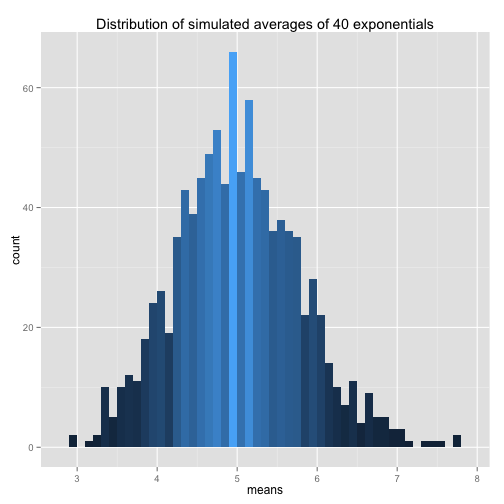
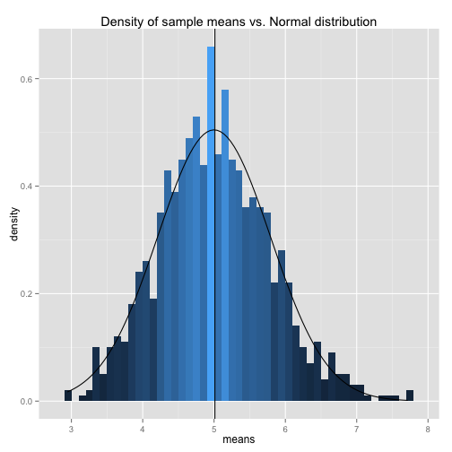
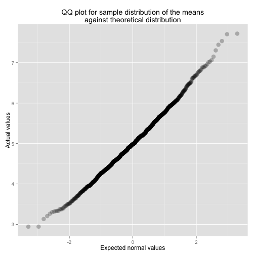

## Overview

The main goal of this document is to investigate the exponential distribution in R and compare it with the Central Limit Theorem. We'll illustrate via simulation and associated explanatory text the properties of the distribution of the mean of 40 exponentials.

## Simulation

Set the workspace

```r
library(ggplot2)
```

The exponential distribution can be simulated in R with `rexp(n, lambda)` where `lambda` is the rate parameter. 

The requirements are:
- Set `lambda = 0.2` for all of the simulations.
- Investigate the distribution of averages of 40 exponentials.
- Do a thousand simulations.


```r
set.seed(123)

nosim <- 1000
n <- 40
lambda <- 0.2

# generate simulations
sims <- data.frame(replicate(nosim, rexp(n, lambda)))

# calculate the averages
means <- sapply(sims, mean)
means <- data.frame(means)

ggplot(data = means, aes(x = means)) + geom_bar(binwidth = 0.1, aes(fill=..count..)) +ggtitle("Distribution of simulated averages of 40 exponentials") + theme(legend.position = "none")
```

 

## Sample Mean versus Theoretical Mean

The mean of exponential distribution is `1 / lambda`. Given the Central Limit Theorem, our expected mean would be:


```r
theor.mean <- 1 / lambda
theor.mean
```

```
## [1] 5
```

Next, we will evaluate the sample mean:

```r
sample.mean <- mean(means$means)
sample.mean
```

```
## [1] 5.011911
```

Let's add the sample mean and the theoretical mean to the plot we've constructed before:


```r
ggplot(data = means, aes(x = means)) + 
  geom_bar(binwidth = 0.1, aes(fill=..count..)) + 
  geom_vline(aes(xintercept = sample.mean), colour="black", size = 1) +
  geom_vline(aes(xintercept = theor.mean), colour="white", alpha=1, size = 1) +
  ggtitle("Sample mean (black) vs. Theoretical mean (white)") + theme(legend.position = "none")
```

 

The center of mean distributions (5.0119113) is very close to the theoretical mean (5). 

## Sample Variance versus Theoretical Variance

The standard deviation of exponential distribution is `1 / lambda`. Given the Central Limit Theorem, our expected variance equals to `sd ^ 2 / n`, where `n` is the sample size (which is 40).

Theoretical variance of the sample means:


```r
theor.variance <- ((1 / lambda) / sqrt(n)) ^ 2 
theor.sd <- sqrt(theor.variance)
theor.variance
```

```
## [1] 0.625
```

Sample variance of averages of simulations:


```r
sample.sd <- sd(means$means)
sample.variance <- var(means$means)
sample.variance
```

```
## [1] 0.6004928
```

Sample standard deviation (0.7749147) is close to the theoretical standard deviation (0.7905694). Sample and expected variances (0.6004928 and 0.625) also look similar (since variances are measured in square units, standard deviations are preferred).

## Distribution

Given the Central Limit Theorem, the distribution of the means should be approximately normal. Let's look at this figure:


```r
ggplot(data = means, aes(x = means)) + 
  geom_histogram(binwidth = 0.1, aes(y=..density.., fill=..density..)) +  
  geom_vline(aes(xintercept = sample.mean)) +
  stat_function(fun = dnorm, args = list(mean = theor.mean, sd = theor.sd)) +
  ggtitle("Density of sample means vs. Normal distribution") + theme(legend.position = "none")
```

 

Indeed, density of calculated means is somehow similar to a normal (bell-shaped) curve (its mean and sd were calculated earlier). We could also build a QQ plot:

```r
ggplot(data = means, aes(sample = means)) + 
  stat_qq(size=4, alpha=0.25) + 
  labs(title = "QQ plot for sample distribution of the means\nagainst theoretical distribution", 
       x = "Expected normal values", 
       y = "Actual values")
```

 
From the look of this QQ plot, we can make the conclusion that the distribution of actual data (sample means) is approximately normal.
